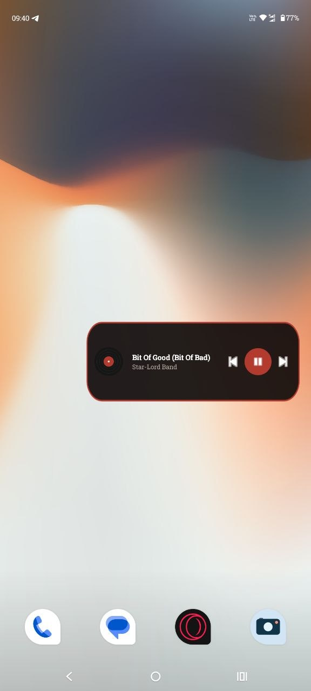

# Vinyl Player

A local music player for Android with a vinyl-turntable-inspired UI, built with Kotlin and Jetpack Compose — no ads, no internet permission, no analytics.

## Overview

Vinyl Player is a from-scratch Android music player built to solve a simple problem: most free local-music players are ad-supported. This app plays audio files already stored on the device, with a custom-drawn turntable UI (rotating disc, animated tonearm), a full equalizer, ID3 cover-art editing, and a home-screen widget — all backed by a single reactive state layer built on Kotlin `StateFlow`.

The project was built iteratively, feature by feature, with an emphasis on getting the underlying Android platform mechanics right (background service lifecycle, thread-safety around ExoPlayer, scoped-storage permission flows) rather than just the UI surface.

## Features

- **Local playback** via `MediaStore` — scans and plays audio already on the device, no streaming, no ads
- **Background playback** through a `MediaSessionService` + ExoPlayer, with lock-screen and notification controls
- **Queue management** — play now, play next, add to queue, with a live queue view
- **Shuffle & repeat**, backed by ExoPlayer's native shuffle order and repeat modes
- **Favorites**, exposed as an auto-populated playlist, plus user-created playlists
- **Library search and sort** (title, artist, album, duration — ascending/descending)
- **Long-press context menu** per track: play, play next, add to queue, add to playlist, properties, delete, edit cover
- **Manual lyrics** — add and edit lyrics per track, stored locally (Room)
- **Cover art editing** — writes a new image directly into the MP3 file's ID3v2 tag (via `mp3agic`), so other players see the change too
- **Real equalizer** — `android.media.audiofx.Equalizer` wired to ExoPlayer's audio session, with presets and per-band control
- **Sleep timer**
- **Full theming** — dark/light mode plus a user-selectable accent color that drives the entire Material3 color scheme (not just a couple of highlight colors)
- **Playback state survives process death** — queue, position, shuffle/repeat and play state are persisted and restored, including resuming playback if Android killed the process mid-song
- **Home screen widget** with an adaptive (compact/full) layout that follows the app's accent color, with play/pause/next/previous
- **Custom splash screen** via `androidx.core.splashscreen`

## Tech Stack

- **Kotlin**, Jetpack **Compose** (Material 3)
- **Media3** (ExoPlayer + MediaSession) for playback
- **Room** for local persistence (lyrics, playlists, favorites)
- **Coroutines / Flow** (`StateFlow`) for reactive state
- **Coil** for image loading
- `android.media.audiofx.Equalizer` for audio effects
- **mp3agic** for ID3v2 tag (cover art) writing
- `AppWidgetProvider` + `RemoteViews` for the home screen widget
- `SharedPreferences` for settings and playback-state persistence

## Architecture

The app follows a single-ViewModel MVVM shape:

- **`AppViewModel`** exposes all app state as `StateFlow`s (library, queue, playback state, favorites, theme, equalizer, sleep timer) and is the only thing Compose screens talk to.
- **`PlaybackService`** (`MediaSessionService`) owns the actual `ExoPlayer` instance, the equalizer, playback-state persistence, and the widget's play/pause/next/previous handling. It survives independently of the UI process.
- **`PlayerController`** is a thin `MediaController`-based bridge between the ViewModel and the service, translating `Player.Listener` callbacks into a single `PlayerUiState`.
- **Data layer**: `MusicLibrary` (MediaStore scanning), `AppDatabase`/Room (lyrics, playlists, favorites), `SettingsStore` (theme + persisted queue snapshot), `DeleteHelper` / `CoverArtHelper` (scoped-storage-aware delete/write flows for Android 10+).
- Screen switching is a plain enum-backed tab state (no navigation library) since the app only has three top-level destinations.

## UI / Design

The player screen is built around a hand-drawn vinyl turntable: a `Canvas`-rendered disc with deliberately asymmetric texture (so rotation reads visually even without album art), a tonearm that swings onto the disc on play and lifts on pause, and album art shown as the record label. The color system is a single user-chosen accent color, blended programmatically into a full Material 3 `ColorScheme` (backgrounds, containers, outlines) so every screen — player, library, playlists, dialogs, the widget — stays visually consistent, with a fixed gold/black/white accent set for retro-styled details.

## Screenshots

<!-- Add screenshots to docs/screenshots/ and reference them below, e.g.:

-->

| Player | Library | Playlists |
|---|---|---|
| _screenshots/player.png_ | _screenshots/library.png_ | _screenshots/playlists.png_ |

| Widget | Theme customization |
|---|---|
| _screenshots/widget.png_ | _screenshots/theme.png_ |

## Widget

A home screen widget mirrors the app's playback state (title, artist, play/pause) and exposes play/pause, next and previous. It renders two layouts — a full version and a compact one — and switches between them based on the widget's actual size, since Android's `RemoteViews` doesn't support the CSS-style responsive layout used in Compose. The widget's accent color and play button are generated at runtime to match whatever accent color is selected in the app.

## What I Learned

- Why `ExoPlayer`/`MediaSession` calls must happen on the main thread, and how a background-thread call turned into an app-wide crash
- The difference between `startService()` and `startForegroundService()` for a media-playback service triggered from outside the app (widget), and the `startForeground()` timing requirement that comes with it
- Scoped storage on Android 10/11+: handling `RecoverableSecurityException` and `MediaStore.createWriteRequest`/`createDeleteRequest` for deleting and rewriting files the app doesn't own
- Persisting enough playback state to survive the OS killing a paused background service, and restoring it correctly (including resuming playback rather than silently going silent)
- Building a single-accent-driven Material 3 color scheme instead of overriding a handful of color slots
- The practical limits of `RemoteViews` for a themed, adaptively-sized widget

## Future Improvements

- Cover art editing for formats beyond MP3 (FLAC, M4A)
- Automatic lyrics fetching and time-synced lyrics
- Crossfade / gapless playback
- Android Auto support
- Automated tests

## Getting Started

1. Clone the repository and open it in Android Studio (Ladybug or newer).
2. Let Gradle sync — the Gradle wrapper is included, no local Gradle install needed.
3. Run on a device or emulator with Android 8.0+ (API 26+).
4. Grant the audio permission on first launch so the library can be scanned.

## License

MIT — see [LICENSE](LICENSE).
